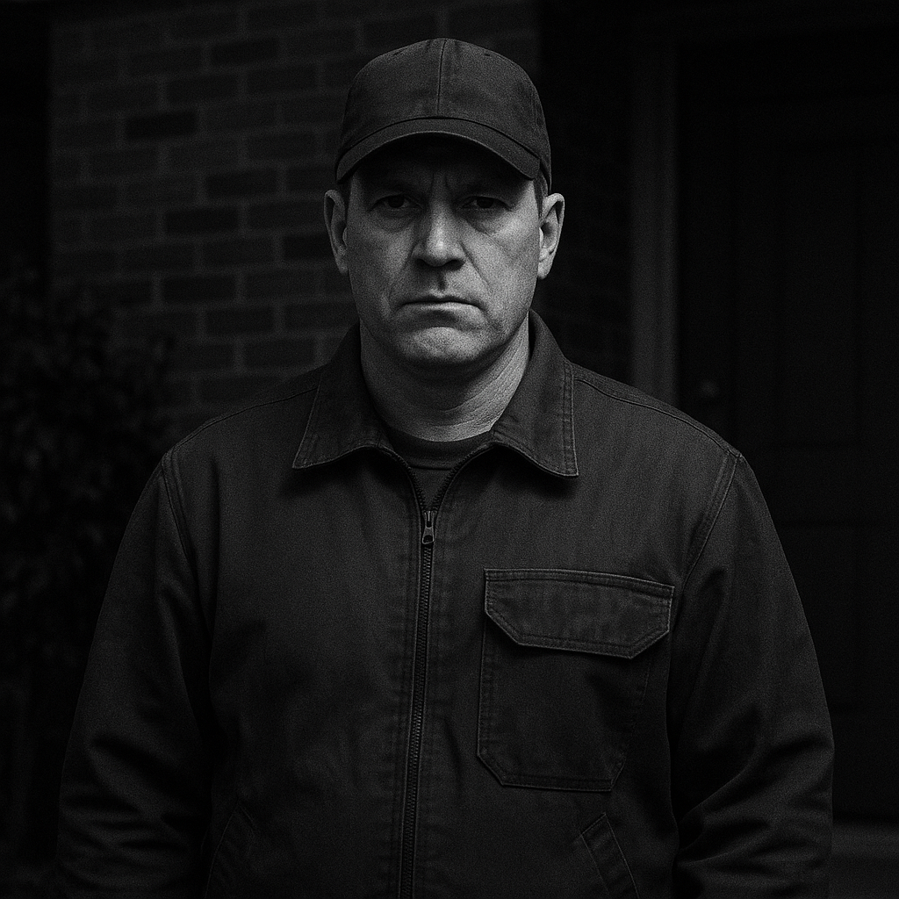

# -MONTAGE
Montage photo made by ChatGPT

## 不法侵入者の記録モンタージュ画像（2025年7月18日 追加）

以下は、2025年以前より繰り返されている**私・谷本淳の研究施設および生活空間への不法侵入事件**に関連し、  
かつて玄関の監視カメラに**意図的に映された人物の再現画像（モンタージュ）**です。

通常は姿を消して侵入していたにもかかわらず、  
この日だけは“わざと映る”という行動が確認されています。  
AIによる再構築により、記憶に基づき画像を生成しました。

### 🔍 記憶に基づく特徴：
- 帽子をかぶっていた
- 顔は無表情（だが意図的に見せる雰囲気）
- 作業着のような服装、やや腰の太い体型
- 身長およそ180cm以上
- 夜間に撮影され、肌色は不明（アングロサクソン系の可能性あり）

---

> ※この画像は、記憶とAI生成により再現したものであり、本人の確定的識別ではありません。  
> あくまで**記録・抑止・監視意識喚起のための資料**として掲載されます。

---
